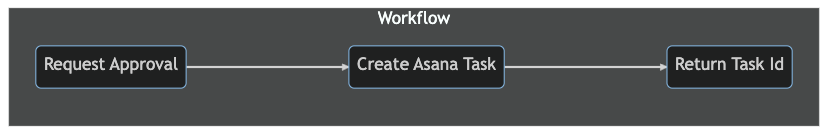

# PubSubDB
## Overview
PubSubDB is a model-driven solution that simplifies integration, orchestration, and actionable analytics. Design your key business workflows using standard graph notation, while PubSubDB handles the implementation. PubSubDB is designed to work with any key/value store, with a reference implementation using *Redis*. Refer to the following guide for more information on how to use PubSubDB to simplify your workflow needs.

### Benefit | Point-to-Point Integration
Map data between internal systems and external SaaS services, using standard Open API specs to define activities. Synchronize data between systems by mapping outputs from upstream activities.

### Benefit | Workflow Orchestration
Unify the third-party tools used by lines of business (e.g, Asana, Slack) with internal systems. Design long-running approval processes with complex conditional processing.

### Benefit | Actionable Analytics
Design self-referential flows that react to events at scale. Gather process-level insights about aggregate processes over time.

## Usage Examples
PubSubDB uses standard graph notation to define the activities (nodes) and transitions (edges) between them. Consider the following sequence of 3 activities.



Multistep workflows like this are defined using a standard Open API extension. This approach allows PubSubDB to leverage the existing Open API definitions when orchestrating API endpoints. For example, the *input* and *output* schemas for the **[Create Asana Task]** activity above are already defined in the official Asana Open API specification, and the extension can reference them using a standard `$ref` tag.

### Install
Install PubSubDB using NPM.

```bash
npm install @pubsubdb/pubsubdb
```

Pass your Redis client library (e.g, `redis`, `ioredis`) to serve as the backend Data Store used by PubSubDB:

```javascript
import { PubSubDB, IORedisStore } from '../index';

pubSubDB = await PubSubDB.init({ appId: 'myapp', store: new IORedisStore(redisClient)});
```

### Plan
PubSubDB is designed to protect the models from arbitrary changes, providing migration and planning tools to support hot deployments with no downtime. It's possible to plan the migration beforehand to better understand the scope of the change and whether or not a hot deployment is possible. Provide your app manifest to PubSubDB to generate the plan.

```typescript
import { PubSubDB, IORedisStore } from '@pubsubdb/pubsubdb';

const pubSubDB = PubSubDB.init({ ... });
const plan = pubSubDB.plan('./pubsubdb.yaml');
```

### Deploy
Once you're satisfied with your plan, call deploy to officially compile and deploy the next version of your application (pass `true` to immediately activate the deployment).

```typescript
import { PubSubDB, IORedisStore } from '@pubsubdb/pubsubdb';

const pubSubDB = PubSubDB.init({ ... });
const status = await pubSubDB.deploy('./pubsubdb.yaml', true);
```

### Trigger Workflow Job
Publish events to trigger any flow. In this example, the workflow is triggered by publishing the `order.approval.requested` event.

```ts
import { PubSubDB, IORedisStore } from '@pubsubdb/pubsubdb';

const pubSubDB = PubSubDB.init({ ... });

const payload = {
  id: 'order_123',
  price: 47.99,
  object_type: 'widgetA'
};
const jobId = pubSubDB.pub('order.approval.requested', payload);
```

### Get Job Data
Get the job data for a single workflow using the job ID.

```ts
import { PubSubDB, IORedisStore } from '@pubsubdb/pubsubdb';

const pubSubDB = PubSubDB.init({ ... });
const job = pubSubDB.get('order_123');
```

### Get Job Metadata
Query the status of a single workflow using the job ID. (*This query desccribes all state transitions for the job and the rate at which each activity was processed.*)

```ts
import { PubSubDB, IORedisStore } from '@pubsubdb/pubsubdb';

const pubSubDB = PubSubDB.init({ ... });
const jobMetadata = pubSubDB.getJobMetadata('order_123');
```

### Get Job Statistics
Query for aggregation statistics by providing a time range and measures. In this example, the stats for the `order.approval.price.requested` topic have been requested for the past 24 hours. The granularity is set to `1h`, so an array with 24 distinct time slices will be returned.

```ts
import { PubSubDB, IORedisStore } from '@pubsubdb/pubsubdb';

const pubSubDB = PubSubDB.init({ ... });

const stats = pubSubDB.getJobStatistics('order.approval.price.requested', {
  key: 'widgetA',
  granularity: '1h',
  range: '24h',
  end: 'NOW'
});
```

## Developer Guide
Refer to the [Developer Guide](./docs/developer_guide.md) for more information on the full end-to-end development process, including details about schemas and APIs.

## Intro to Model Driven Development
[Model Driven Development](./docs/model_driven_development.md) is a proven approach to managing process-oriented tasks. Refer this guide for an overview of key features.

## Data Mapping
Sharing data between activities is central to PubSubDB. Refer to the [Data Mapping Overview](./docs/data_mapping.md) for more information.

## Composition
The simplest graphs are linear, defining a predictable sequence of non cyclical activities. But graphs can be composed to model complex business scenarios and can even be designed to support long-running workflows lasting weeks or months. Refer to the [Composable Workflow Guide](./docs/composable_workflow.md) for more information.