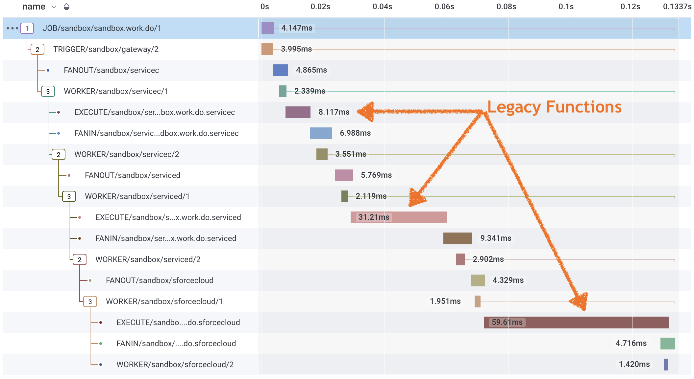

# PubSubDB


Build sophisticated, durable workflows without the overhead of a dedicated server cluster. With PubSubDB, your code remains front and center using [infrastructure](./docs/faq.md#what-is-pubsubdb) you already own.

## Install
[](https://badge.fury.io/js/%40pubsubdb%2Fpubsubdb)

```sh
npm install @pubsubdb/pubsubdb
```

## Design
PubSubDB's TypeScript SDK is modeled after [Temporal IO's](https://github.com/temporalio) developer-friendly SDK. Design and deploy durable workflows using familiar paradigms that keep your code delightful to maintain. Deploying Temporal's [hello-world tutorial](https://github.com/temporalio/samples-typescript/tree/main/hello-world/src), for example, requires few changes beyond importing from PubSubDB instead.

**./activities.ts**
```javascript
export async function greet(name: string): Promise<string> {
  return `Hello, ${name}!`;
}
```

**./workflows.ts**
```javascript
import { Durable } from '@pubsubdb/pubsubdb';
import type * as activities from './activities';

const { greet } = Durable.workflow.proxyActivities<typeof activities>();

export async function example(name: string): Promise<string> {
  return await greet(name);
}
```

**./worker.ts**
```javascript
import { Durable } from '@pubsubdb/pubsubdb';
import Redis from 'ioredis'; //OR `import * as Redis from 'redis';`
import * as activities from './activities';

async function run() {
  const connection = await Durable.NativeConnection.connect({
    class: Redis,
    options: {
      host: 'localhost',
      port: 6379,
    },
  });
  const worker = await Durable.Worker.create({
    connection,
    namespace: 'default',
    taskQueue: 'hello-world',
    workflowsPath: require.resolve('./workflows'),
    activities,
  });
  await worker.run();
}

run().catch((err) => {
  console.error(err);
  process.exit(1);
});
```

**./client.ts**
```javascript
import { Durable } from '@pubsubdb/pubsubdb';
import Redis from 'ioredis';
import { nanoid } from 'nanoid';

async function run() {
  const connection = await Durable.Connection.connect({
    class: Redis,
    options: {
      host: 'localhost',
      port: 6379,
    },
  });

  const client = new Durable.Client({
    connection,
  });

  const handle = await client.workflow.start({
    args: ['PubSubDB'],
    taskQueue: 'hello-world',
    workflowName: 'example',
    workflowId: 'workflow-' + nanoid(),
  });

  console.log(`Started workflow ${handle.workflowId}`);
  console.log(await handle.result());
}

run().catch((err) => {
  console.error(err);
  process.exit(1);
});
```

>PubSubDB delivers durable function execution using a swarm of [distributed engines](./docs/distributed_orchestration.md). The architecture optimally consumes leftover CPU on your overprovisioned services to durably orchestrate workflows without the cost, complexity and vulnerability of a central server.

## Advanced Design
PubSubDB's TypeScript SDK is the easiest way to make your functions durable. But if you need full control over your function lifecycles (including high-volume, high-speed use cases), you can use PubSubDB's underlying YAML models to design and deploy durable workflows. The following model depicts a sequence of activities orchestrated by PubSubDB. Any function associated with the `topic` in the YAML definition is guaranteed to succeed when run.

```yaml
app:
  id: sandbox
  version: '1'
  graphs:
    - subscribes: sandbox.work.do
      publishes: sandbox.work.done

      activities:
        gateway:
          type: trigger
        servicec:
          type: worker
          topic: sandbox.work.do.servicec
        serviced:
          type: worker
          topic: sandbox.work.do.serviced
        sforcecloud:
          type: worker
          topic: sandbox.work.do.sforcecloud

      transitions:
        gateway:
          - to: servicec
        servicec:
          - to: serviced
        serviced:
          - to: sforcecloud
```

### Initialize
Provide your chosen Redis instance and configuration options to start a PubSubDB Client. *PubSubDB supports both `ioredis` and `redis` clients interchangeably.*

```javascript
import { PubSubDB } from '@pubsubdb/pubsubdb';
import Redis from 'ioredis'; //OR `import * as Redis from 'redis';`

const pubSubDB = await PubSubDB.init({
  appId: 'sandbox',
  engine: {
    redis: {
      class: Redis,
      options: { host, port, password, db } //per your chosen Redis client
    }
  }
});
```

A PubSubDB Client can be used to trigger worfkows and subscribe to results.

### Trigger a Workflow
Call `pub` to initiate a workflow. This function returns a job ID that allows you to monitor the progress of the workflow.

```javascript
const topic = 'sandbox.work.do';
const payload = { };
const jobId = await pubSubDB.pub(topic, payload);
```

### Subscribe to Events
Call `sub` to subscribe to all workflow results for a given topic.

```javascript
await pubSubDB.sub('sandbox.work.done', (topic, jobOutput) => {
  // use jobOutput.data
});
```

### Trigger and Wait
Call `pubsub` to start a workflow and *wait for the response*. PubSubDB establishes a one-time subscription and delivers the job result once the workflow concludes.

```javascript
const jobOutput = await pubSubDB.pubsub(topic, payload);
```

>The `pubsub` method is a convenience function that merges pub and sub into a single call. Opt for PubSubDB's queue-driven engine over fragile HTTP requests to develop resilient solutions.

### Link Worker Functions
Link worker functions to a topic of your choice. When a workflow activity in the YAML definition with a corresponding topic runs, PubSubDB will invoke your function.

```javascript
import { PubSubDB } from '@pubsubdb/pubsubdb';
import Redis from 'ioredis';

const pubSubDB = await PubSubDB.init({
  appId: 'sandbox',
  workers: [
    { 
      topic: 'sandbox.work.do.servicec',
      redis: {
        class: Redis,
        options: { host, port, password, db }
      }
      callback: async (data: StreamData) => {
        return {
          metadata: { ...data.metadata },
          data: { }
        };
      }
    }
  ]
};
```

### Observability
Workflows and activities are run according to the rules you define, offering [Graph-Oriented](./docs/system_lifecycle.md#telemetry) telemetry insights into your legacy function executions.




## FAQ
Refer to the [FAQ](./docs/faq.md) for terminology, definitions, and an exploration of how PubSubDB facilitates orchestration use cases.

## Quick Start
Refer to the [Quick Start](./docs/quickstart.md) for sample flows you can easily copy, paste, and modify to get started.

## Developer Guide
For more details on the complete development process, including information about schemas, APIs, and deployment, consult the [Developer Guide](./docs/developer_guide.md).

## Model Driven Development
[Model Driven Development](./docs/model_driven_development.md) is an established strategy for managing process-oriented tasks. Check out this guide to understand its foundational principles.

## Data Mapping
Exchanging data between activities is central to PubSubDB. For detailed information on supported functions and the functional mapping syntax (@pipes), see the [Data Mapping Overview](./docs/data_mapping.md).

## Composition
While the simplest graphs are linear, detailing a consistent sequence of non-cyclical activities, graphs can be layered to represent intricate business scenarios. Some can even be designed to accommodate long-lasting workflows that span months. For more details, check out the [Composable Workflow Guide](./docs/composable_workflow.md).

## Architectural First Principles
For a deep dive into PubSubDB's distributed orchestration philosophy, refer to the [Architectural First Principles Overview](./docs/architecture.md).

## Distributed Orchestration
PubSubDB is a distributed orchestration engine. Refer to the [Distributed Orchestration Guide](./docs/distributed_orchestration.md) for a detailed breakdown of the approach.

## System Lifecycle
Gain insight into the PubSubDB's monitoring, exception handling, and alarm configurations via the [System Lifecycle Guide](./docs/system_lifecycle.md).
