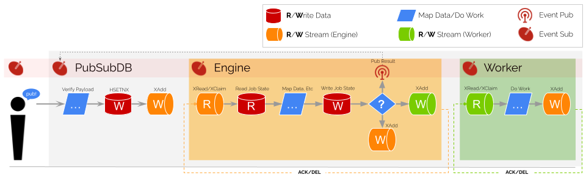

# A Distributed Engine Architecture for Operationalizing Data at Web Scale

- [Introduction](#introduction)
- [First Principles](#first-principles)
  * [Sequence Activities with a DAG](#sequence-activities-with-a-dag)
  * [Limit Execution Scope to ECA](#limit-execution-scope-to-eca)
  * [Duplex Activity Execution Calls](#duplex-activity-execution-calls)
  * [Mediate Duplexed Calls With EAI](#mediate-duplexed-calls-with-eai)
  * [Leverage CQRS for Self-Perpetuation](#leverage-cqrs-for-self-perpetuation)
  * [Orchestrate through Emergent State](#orchestrate-through-emergent-state)
- [Scalability Benefits](#scalability-benefits)
  * [Fan-out Scalability](#fan-out-scalability)
  * [Fan-in Scalability](#fan-in-scalability)
  * [Data Scaling Simplicity](#data-scaling-simplicity)
  * [Engine Scaling Simplicity](#engine-scaling-simplicity)
- [Comparison to Other Architectures](#comparison-to-other-architectures)

## Introduction
The [Ajax/Single Page Application architecture](https://patents.google.com/patent/US8136109) efficiently solves distributed state at Web scale by cleanly separating data and processing instructions into two distinct channels. PubSubDB is modeled using this architecural Pattern, with a reference implementation using Redis as the *Server* and PubSubDB as the *Client(s)*. 

### Central Server
A home server provides the instructions to each connected client, journaling all events in an immutable ledger. Importantly, the home server *never* executes its processing instructions but does serve as the single source of truth for storing the results.


### Distributed Clients
Each time a client receives an event, it processes and routes it according to its cached instruction sets received from the server. Clients *never* retain state (they never journal the events they process) but are allowed to cache the execution rules as they are immutable.

## First Principles
There are a set of architectural first-principles that undergird how state and process must be separated to realize the full performance benefit of this scheme. They are inconsequential individually, but when applied as a set, they enable distributed computation at scale, without back-pressure, overflow, timeout and other risks typically associated with networked systems.

By converting the application into a series of stateless, single-purpose execution instructions, the network expands and contracts in real-time to absorb assymetry at its source. And it does so entirely headless without a central governing body, which is why its scale is limited only by Redis' ability to scale.

### Sequence Activities with a DAG
PubSubDB uses a Directed Acyclic Graph (DAG) variant known as rooted tree to model the activity flow. This was chosen due to its strict enforcement of a single entry point while still allowing for parallel activities. Sequence and parallelization are both critical to building an efficient execution engine, and the DAG is the most efficient representation that achieves this.


### Limit Execution Scope to ECA
Event-driven architectures are known for their high performance and ability to handle variable and burst workloads efficiently. In this pattern, publishers send messages without knowing which subscribers, if any, are receiving them. The essential computational unit for event-driven architectures is the Event->Condition->Action (ECA) pattern. The Distributed Event Bus limits its process scope to this single unit of execution before terminating the process.


### Duplex Activity Execution Calls
The conventional ECA (Event-Condition-Action) model treats the *Action* as a single atomic operation, primarily because it does not inherently support state retention. Therefore, in order to handle long-running business processes and ensure uninterrupted data exchange, it becomes necessary to divide the *Action* into two distinct components. This division forms the basis for a full-duplex system, where each activity comprises two legs, "beginning" and "conclusion," bridged by an asynchronous wait state. Importantly, this transformation adheres to the fundamental principles of ECA by giving rise to two distinct ECA sequences for initiating and concluding the activity.


The duplexing principle is fundamental to the operation of the engine (the quorum), which interprets an activity's execution as two interconnected yet standalone actions. The following pseudo-code representation provides an insight into the engine's role in processing an activity:

```
On EVENT (PARENT ACTIVITY COMPLETED):
  If CONDITION:
    EXECUTE ACTION-BEGIN (Duplex Leg 1)

--------------- EXTERNAL SYSTEM PROCESSING ----------------

On EVENT (WORKER COMPLETED):
  If CONDITION (JOB STILL ACTIVE):
    EXECUTE ACTION-END (Duplex Leg 2)
```

In this context, **ACTION BEGIN** marks the commencement of a process, such as dispatching a request or launching a long-running operation. **EXTERNAL SYSTEM PROCESSING** symbolizes the asynchronous event that the engine awaits, like user approval or the completion of a complex calculation. Upon fulfilling this condition, **ACTION END** is executed, finalizing the results.

Importantly, this dual-action approach spawns a seemingly perpetual chain of activities. The engine consistently finds itself processing either the concluding leg of a previous activity or the initiating leg of the subsequent one. This method of duplexing serves as the linchpin in accomplishing fluid, responsive, and efficient orchestration of long-running processes in a headless system. It adheres to the ECA pattern, restricts the execution scope to one unit at a time, and critically, allows the system to maintain high throughput by optimally managing its computational resources.

### Mediate Duplexed Calls with EAI
The transformation of isolated event-driven operations, or ECA units, into cohesive business processes calls for an intermediary abstraction layer to direct and synchronize these individual units. [Enterprise Application Integration](https://en.wikipedia.org/wiki/Enterprise_application_integration) (EAI) plays this pivotal role, acting as a crucial orchestrator.


EAI serves as a principal scheme for unification, amalgamating separate ECA units into a comprehensive network of business processes. It ensures that the transmitted data complies with predetermined schemas and data types, thereby enhancing interoperability and ensuring data consistency across the headless system.

### Leverage CQRS for Self-Perpetuation
In the orchestration of business processes, *operational continuity* emerges as a critical aspect. This is where Command Query Responsibility Segregation (CQRS) has a pivotal role to play by decoupling the read (query) and write (command) operations in a system. Consider a sequence of tasks: `A`, `B`, and `C`. In a conventional execution flow, the completion of `A` directly initiates `B`, which in turn sets off `C`:

```
A --> B --> C
```

This presents a chain of dependencies where the execution of one task is directly bound to its predecessor, making the system vulnerable to bottlenecks and cascading failures. With CQRS, this is addressed by linking the *logged* completion of `A` to the initiation of `B` and `B`'s *logging* to the initiation of `C`, etc:

```
A --> log[A completed] --> B --> log[B completed] --> C
```

In this scenario, the producers (tasks) merely inscribe their completion events onto the log. Concurrently, the consumers (the triggers for ensuing tasks) read from this log. This separation is of key significance: the progression of the workflow is driven not by the producer prompting the next task directly, but by the consumer's act of reading from the log. Note in the following how the Engine and Worker are decoupled from each other (and from the outside callers as well):



This simple mechanism of reading from one stream and writing to another is the basis for the entire system and how complex workflows are achieved. Every complex workflow is simply a series of singular activities implicitly stitched together by writing to streams in a sequence.

### Orchestrate through Emergent State
Activity collation forms the nexus of an asynchronous workflow system, bearing the critical responsibility of tracing and managing the state of all activities within an active process or a "Job". This task is accomplished through a multi-digit collation key. Each digit within this key is a symbolic representation of the status of a specific activity in the workflow.


The collation key structure is conceived with explicit numeric values designated for various states an activity might exhibit:

- 9: Pending
- 8: Started
- 7: Errored
- 6: Completed
- 5: Paused
- 4: Released
- 3: Skipped
- 2: `Await` Right Parentheses
- 1: `Await` Left Parentheses
- 0: N/A (the flow has fewer activities than the collation key)

This structured approach empowers a quick understanding of the job's current state from a mere glance at the collation key. Moreover, two special digits, 1 and 2, are designated for 'bookending' subordinated workflows, a design decision that streamlines the expression of a composite job state. For example, a composite state of `36636146636626` tells us that two separate workflows, Flow A and Flow B, have concluded successfully, where Activity 5 in Flow A spawned Flow B, and the latter returned its response successfully.

The Collation Service employs an ascending string sorting methodology to counter the absence of a sibling node order guarantee in a Directed Acyclic Graph (DAG). Despite the trigger being the first element in the graph, it could be placed fifth alphabetically, as seen in the following sequence:

 `quick => brown => fox => (jumped|(slept => ate))`

The sorted ids for this chain of activities would translate to:

 `["ate", "brown", "fox", "jumped", "quick", "slept"]`

Consequently, the collation key updates to `999969000000000` upon the trigger activity's completion.

With this foundational understanding, we can explore a few examples. Consider the collation key `968969000000000`, which signifies that the `quick` and `brown` activities have *completed* and `fox` is currently *started*. The collation key undergoes continual updates as the job progresses, mirroring the state changes of the activities until the job's completion.

Conversely, a collation key like `766366000000000` symbolizes an *error* state. The `ate` activity returned an error, and the `jumped` activity was *skipped*, with all other activities concluding normally. The system, aware of no other active activity, completes the job, albeit in an error state.

## Scalability Benefits
### Fan-out Scalability
PubSubDB supports scale out by distributing processing instructions to a growing number of clients. (*This is an advantage of event-driven architectures and isn't unique to PubSubDB.*) As new clients connect, the home server delivers the instructions, enabling each client to increase the throughput.

### Fan-in Scalability
While fan-in scenarios are typically resource-intensive, PubSubDB efficiently handles them by leveraging the emergent state management capabilities inherent in the architecture. The underlying component model organizes runtime events in a deterministic manner, allowing the system to handle complex dependencies and relationships without sacrificing performance or scalability. *There is no **performance** cost associated with tracking deeply nested, compositional state within your workflows. Implementations are only limited by the **memory** constraints of the central data store (e.g, Redis).*

### Data Scaling Simplicity
Since PubSubDB focuses on exchanging pure data, scaling the system becomes more straightforward. The primary concern is managing the data scaling solution, such as Redis, without having to consider the intricacies of the client layer. This separation of concerns simplifies maintainability and ensures that the system can efficiently grow using standard cloud data scaling solutions.

### Engine Scaling Simplicity
An essential aspect of the distributed engine architecture, is that each connected client is responsible for executing thier processing instructions independently. Scaling the distributed engine is essentially free, as clients handle the processing and manipulation.

## Comparison to Other Architectures
Traditional server-side architectures that rely on in-server engines, such as Redis with Lua, can struggle to scale and maintain performance as the number of clients and processing requirements grow. By avoiding in-server engines and focusing on the core principle of exchanging pure data, the Ajax/Single Page Application architecture is a proven, scalable solution for distributed state management.
