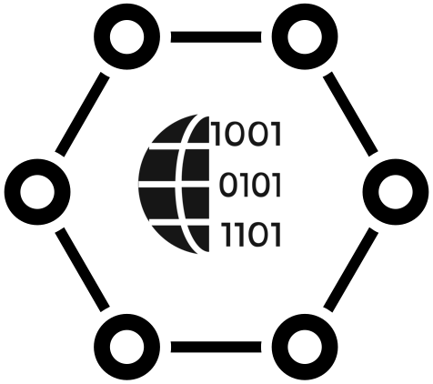

# A Distributed Engine Architecture for Operationalizing Data at Web Scale

- [Introduction](#introduction)
- [Distributed Event Bus](#distributed-event-bus)
- [First Principles](#first-principles)
  * [Sequence Activities with a DAG](#sequence-activities-with-a-dag)
  * [Limit Execution Scope to ECA](#limit-execution-scope-to-eca)
  * [Duplex Activity Execution Calls](#duplex-activity-execution-calls)
  * [Mediate Duplexed Calls With EAI](#mediate-duplexed-calls-with-eai)
  * [Orchestrate through Emergent State](#orchestrate-through-emergent-state)
- [Scalability Benefits](#scalability-benefits)
  * [Fan-out Scalability](#fan-out-scalability)
  * [Fan-in Scalability](#fan-in-scalability)
  * [Data Scaling Simplicity](#data-scaling-simplicity)
  * [Engine Scaling Simplicity](#engine-scaling-simplicity)
- [Comparison to Other Architectures](#comparison-to-other-architectures)

## Introduction
The [Ajax/Single Page Application architecture](https://patents.google.com/patent/US8136109) efficiently solves distributed state at Web scale by cleanly separating data and processing instructions into two distinct channels. A home server provides the instructions to each connected client but does not execute the processing instructions itself. The clients then cache and execute the instructions and exchange pure data (the results of the execution) with the home server.

## Distributed Event Bus
PubSubDB builds upon the *Distributed Engine* Pattern, delivering a specific type of engine referred to as an *Event Bus* or *Integration Server*. Each time a *Distributed Bus* receives an event, it processes and routes it according to its cached execution rules. The solution is a fully functional *Enterprise Application Integration* (EAI) deployment with all expected execution patterns supported.

## First Principles
There are a set of architectural first-principles that undergird how state and process must be separated to realize the full performance benefit. They can seem inconsequential individually, but when applied as a set, they enable distributed computation at scale, without back-pressure, overflow, timeout and other risks typically associated with networked systems.

By converting the application into a series of stateless, single-purpose execution instructions, the network expands and contracts in real-time to absorb assymetry at its source.

### Sequence Activities with a DAG
The Distributed Event Bus uses a Directed Acyclic Graph (DAG) variant known as rooted tree to model the activity flow. This was chosen due to its strict enforcement of a single entry point while still allowing for parallel activities. Sequence and parallelization are both critical to building an efficient execution engine, and the DAG is the most efficient representation that achieves this.

### Limit Execution Scope to ECA
Event-driven architectures are known for their high performance and ability to handle variable and burst workloads efficiently. In this pattern, publishers send messages without knowing which subscribers, if any, are receiving them. The essential computational unit for event-driven architectures is the Event->Condition->Action (ECA) pattern. The Distributed Event Bus limits its process scope to this single unit of execution before terminating the process.

### Duplex Activity Execution Calls
To address the need for long-running business processes, including those that support human activities while remaining true to the principles of the ECA pattern, the Distributed Event Bus splits the Action (A) into two parts, executing a single activity in the process flow as a full-duplex data exchange.  When executed by the engine each activity begins with part 2 of the parent activity's call and concludes with part 1 of the child activity's call. This enables the Async/Await pattern, making it possible to pause any high-throughput execution and interleave human activities like reviews and approvals (again, without performance cost).

### Mediate Duplexed Calls with EAI
[Enterprise Application Integration](https://en.wikipedia.org/wiki/Enterprise_application_integration) (EAI) is considered the defining standard for integration architectures due to its universal ability to coordinate data exchange between service endpoints. It was chosen for this reason to serve as the glue between the ECA units of execution and convert the event stream into meaningful business processes. The architecture is rigorous and requires strict adherence to schemas and types when transmitting data. Key features include a uniform data model and a pluggable connector/adapter model.

### Orchestrate through Emergent State
The Distributed Event Bus implicitly manages process orchestration (collation, aggregation, inter-flow coordination, etc) by using a quorum of connected clients to act as a stand-in for the central server. Process state is implicitly generated by the quorum without any single client being aware of the uber-process. This is facilitated via a [multi-digit collation key](../services/collator/README.md) that represents the state of all activities in a running flow. As each connected client processes its single ECA unit of execution, the backend data store (Redis) will return long integers that trigger fan-in resolution without the performance overhead of a central orchestrating server.

## Scalability Benefits
### Fan-out Scalability
PubSubDB supports scale out by distributing processing instructions to a growing number of clients. (*This is an advantage of event-driven architectures and isn't unique to PubSubDB.*) As new clients connect, the home server delivers the instructions, enabling each client to increase the throughput.

### Fan-in Scalability
While fan-in scenarios are typically resource-intensive, PubSubDB efficiently handles them by leveraging the emergent state management capabilities inherent in the architecture. The underlying component model organizes runtime events in a deterministic manner, allowing the system to handle complex dependencies and relationships without sacrificing performance or scalability. *There is no **performance** cost associated with tracking deeply nested, compositional state within your workflows. Implementations are only limited by the **memory** constraints of the central data store (e.g, Redis).*

### Data Scaling Simplicity
Since PubSubDB focuses on exchanging pure data, scaling the system becomes more straightforward. The primary concern is managing the data scaling solution, such as Redis, without having to consider the intricacies of the client layer. This separation of concerns simplifies maintainability and ensures that the system can efficiently grow using standard cloud data scaling solutions.

### Engine Scaling Simplicity
An essential aspect of the distributed engine architecture, is that each connected client is responsible for executing thier processing instructions independently. Scaling the distributed engine is essentially free, as clients handle the processing and manipulation.

## Comparison to Other Architectures
Traditional server-side architectures that rely on in-server engines, such as Redis with Lua, can struggle to scale and maintain performance as the number of clients and processing requirements grow. By avoiding in-server engines and focusing on the core principle of exchanging pure data, the Ajax/Single Page Application architecture is a proven, scalable solution for distributed state management.
