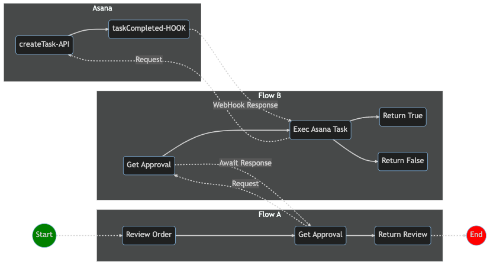
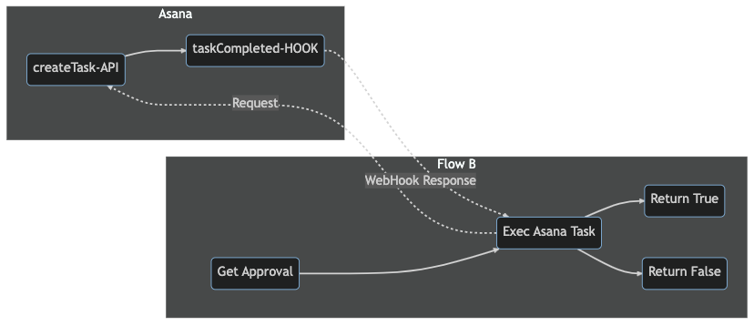
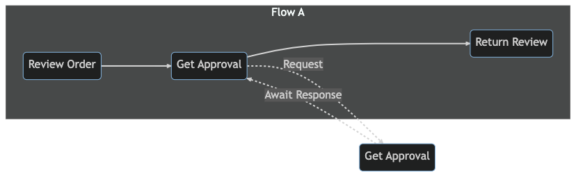

# Composable Workflow
PubSubDB workflows are defined as *rooted out-trees* which means we use graphs with a single root (trigger), from which the `activities` branch out in a tree-like structure, *with no cycles*. This structure allows for efficient scheduling and execution of tasks and is used in parallel and distributed computing systems.

When the graph is deployed, the PubSubDB compiler will subscribe activities to topics, ensuring workflow activities execute in sequence, while still adhering to the principles of a loosely-coupled, event-driven architecture.

<small>**PUBSUBDB WORKFLOW DEFINITION FILE**</small>

```yaml
activities:
  a1:
    title: Request Approval
    type: trigger
  a2:
    title: Create Asana Task
    type: openapi
    subtype: asana.1.createTask
  a3:
    title: Save Task ID
    type: return

transitions:
  a1:
    - to: a2
  a2:
    - to: a3

subscribes:
  - topic: approval.requested
    activity: a1

publishes: 
  - topic: approval.responded
    activity: a1
```

## Composition
The simplest graphs are linear, defining a predictable sequence of non cyclical activities. But graphs can be composed to model complex business scenarios and can even be designed to support long-running workflows lasting weeks or months. 

In general, there are two ways to incorporate long-running activities into a PubSubDB workflow: *hook* and *await*.

### Hook
The `hook` pattern is used when coordinating **external**, long-running tasks. The term, `hook`, is shorthand for `WebHook` as WebHooks are commonly used to drive this behavior, where the system pauses until an external event signals it to resume. This is common with approval flows where an approval task gets created, but a WebHook is used to signal when it completes.

### Await
The `await` pattern is **internally** focused and is used when an activity in one flow invokes another flow. The engine will pause the caller activity until a response is received.



### Example | Asana WebHook
Flow B includes a *compositional* activity, namely, **Exec Asana Task** (`a2`). This activity makes a call to Asana to create a task and then sleeps. 



Given the `conditions` for activity `a2` (as defined by its `hooks` configuration) activity, `a2`, will only awaken if Asana sends a WebHook event with a matching `task_id` and a `status` of *completed*. For example:

```yaml
# ./myapp/2/flowb/1.yaml
openapi: 3.0.3
components:

  x-pubsubdb:
    activities:
      a1:
        title: Get Approval
        type: trigger
        settings:
          schema:
            $ref: ./schemas.yaml#/a1_settings
          maps:
            $ref: ./maps.yaml#/a1_settings
        input:
          schema:
            $ref: ./schemas.yaml#/Input1
          maps:
            $ref: ./maps.yaml#/a1_input
        output:
          schema:
            $ref: ./schemas.yaml#/a1_output
        return:
          schema:
            $ref: ./schemas.yaml#/a1_return
        errors:
          schema:
            $ref: ./schemas.yaml#/a1_errors
        stats:
          id: {$self.output.data.id}
          key: {$self.output.data.object_type}
          measures:
            - measure: count
              target: {$self.output.data.region}
            - measure: count
              target: {$self.output.data.division}
      a2:
        title: Exec Asana Task
        type: openapi
        # Asana Open API Operation Name (`createTask`)
        openapi: asana.1.createTask
        credentials: asana.1.mycreds
        hook:
          schema:
            $ref: ./schemas.yaml#/a2_hook
        input:
          schema:
            $ref: /specs/asana/1.yml#/TaskRequest
          maps:
            $ref: ./maps.yaml#/a2_input
        output:
          schema:
            $ref: /specs/asana/1.yml#/TaskResponse
        errors:
          schema:
            $ref: /specs/asana/1.yml#/TaskResponseError
      a3:
        title: Return True
        type: return
        input:
          # the activity, `a1`, references the `return` schema
          maps:
            $ref: './maps.yaml#/a3_input'
      a4:
        title: Return False
        type: return
        input:
          maps:
            $ref: './maps.yaml#/a4_input'

    transitions:
      a1:
        - to: a2
      a2:
        - to: a3
          conditions:
            match:
              - expected: true
                actual: {a2.hook.data.approved}
        - to: a4
          conditions:
            gate: or
            match:
              - expected: false
                actual: {a2.hook.data.approved}
              - expected: false
                actual: {a1.output.data.price}
                operator: ">"
                value: 100

    hooks:
      - to: a2
        topic: asana.1.taskUpdated
        conditions:
          gate: and
          match:
            - expected: {$self.output.data.task_id}
              actual: {$self.hook.data.task_id}
            - expected: completed
            - actual: {$self.hook.data.status}

    subscribes:
      - topic: order.approve
        activity: a1

    publishes: 
      - topic: order.approved
        activity: a1
```

### Example | Await
Flow A also includes a *compositional* activity, namely, **Get Approval** (`a6`). This activity calls another flow and awaits the response. This is similar to `hook` type activities except that it is internal (flow-to-flow), so the mechanics are simpler, requiring no special configuration.




```yaml
# ./myapp/2/flowa/1.yaml
openapi: 3.0.3
components:
  x-pubsubdb:

    activities:
      a5:
        title: Review Order
        type: trigger
        settings:
          schema:
            $ref: ./schemas.yaml#/a5_settings
          maps:
            $ref: ./maps.yaml#/a5_settings
        input:
          schema:
            $ref: ./schemas.yaml#/a5_input
          maps:
            $ref: ./maps.yaml#/a5_input
        output:
          schema:
            $ref: ./schemas.yaml#/a5_output
        return:
          schema:
            $ref: ./schemas.yaml#/a5_return
        errors:
          schema:
            $ref: ./schemas.yaml#/a5_errors
        stats:
          key: {a1.input.data.object_type}
          measures:
            - measure: sum
              target: {a1.input.data.price}
            - measure: count
              target: {a1.input.data.price}
              operator: ">"
              value: 100
            - measure: avg
              target: {a1.input.data.price}
      a6:
        title: Get Approval
        type: await
        subtype: order.approve
        input:
          schema:
            $ref: ./schemas.yaml#/a6_input
        output:
          schema:
            $ref: ./schemas.yaml#/a6_output
        errors:
          schema:
            $ref: ./schemas.yaml#/a6_errors
      a7:
        title: Return Review
        type: return
        input:
          maps:
            $ref: ./maps.yaml#/a7_input

    transitions:
      a5:
        - to: a6
      a6:
        - to: a7

    subscribes:
      - topic: order.review
        activity: a5

    publishes: 
      - topic: order.reviewed
        activity: a5
```

## Asana Open API Spec
Here is a snapshot of the official Asana Open API Spec with just the createTask operation included. Incorporating external services like Asana into the activity flow is possible using a standard Open API schema.

```yaml
openapi: 3.0.3
info:
  title: Asana API
  description: Asana's public OpenAPI spec for creating tasks and handling webhooks.
  version: 1.0.0
servers:
  - url: https://app.asana.com/api/v1

paths:
  /tasks:
    post:
      summary: Create a task
      description: Create a new task in Asana
      operationId: createTask
      requestBody:
        required: true
        content:
          application/json:
            schema:
              $ref: '#/TaskRequest'
      responses:
        200:
          description: Task created successfully
          content:
            application/json:
              schema:
                $ref: '#/TaskResponse'
        default:
          description: Error creating task
          content:
            application/json:
              schema:
                $ref: '#/TaskResponseError'

components:
  schemas:
    TaskRequest:
      type: object
      properties:
        name:
          type: string
          description: The name of the task
        notes:
          type: string
          description: Additional notes for the task
        assignee:
          type: string
          description: The assignee for the task
        due_on:
          type: string
          format: date
          description: The due date for the task
      required:
        - name

    TaskResponse:
      type: object
      properties:
        task_id:
          type: string
          description: The unique identifier for the created task
        data:
          type: object
          properties:
            id:
              type: string
              description: The unique identifier for the created task
            created_at:
              type: string
              format: date-time
              description: The timestamp when the task was created
            modified_at:
              type: string
              format: date-time
              description: The timestamp when the task was last modified
            name:
              type: string
              description: The name of the task
            notes:
              type: string
              description: Additional notes for the task
            assignee:
              type: string
              description: The assignee for the task
            due_on:
              type: string
              format: date
              description: The due date for the task

    TaskResponseError:
      type: object
      properties:
        message:
          type: string
          description: A human-readable error message
        errors:
          type: array
          items:
            type: object
            properties:
              message:
                type: string
                description: A human-readable error message for the specific error
              help:
                type: string
                description: A link to more information about the error
```
