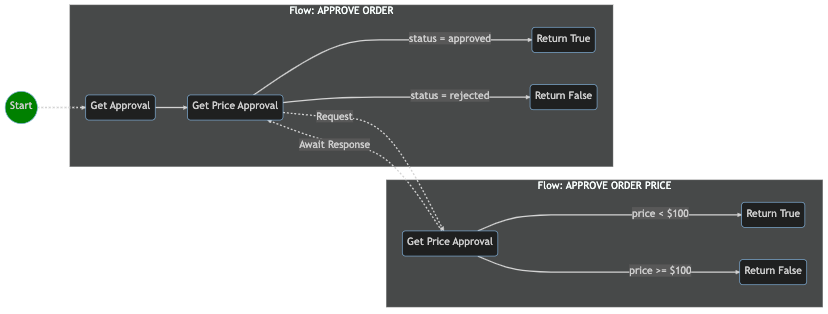

# Developer Guide

This guide defines the recommended development process for deploying a PubSubDB solution and will walk you through the essential steps to building maintainable workflows. 

## Table of Contents
1. [Define the Business Process](#define-the-business-process)
2. [Define Activity Graphs](#define-activity-graphs)
3. [Define Conditional Activities](#define-conditional-activities)
4. [Define Activity Topics](#define-activity-topics)
5. [TIP: Organizing for Maintinability](#tip-organizing-files-for-maintainability)
6. [Define Activity Schemas](#define-activity-schemas)
7. [Define Map Rules](#define-map-rules)
8. [Define Statistics](#define-statistics)
9. [Plan](#plan)
10. [Deploy](#deploy)
11. [Trigger Workflow Job](#trigger-workflow-job)
12. [Get Job Data](#get-job-data)
13. [Retrieve Job Metadata](#get-job-metadata)
14. [Get Aggregat e Job Statistics](#get-job-statistics)


## Define the Business Process
Refining your current business process, or defining a new one, is a first crucial step in deploying a successful PubSubDB solution. A key aspect of this step is identifying the subprocesses that comprise the overall process, as PubSubDB is a compositional system.

For purposes of this guide, assume that the business process is as follows, where every time an order gets created, a secondary approval flow is run that checks the price. If the price is less than $100, the order will be approved; if not, it gets rejected.



## Define Activity Graphs
Understanding the underlying business process gathered from step 1 is crucial, as it forms the foundation for defining the activity flow necessary to achieve it. 

An example graph in YAML, showcasing three activities, is provided below for the **Approve Order** business process:

```yaml
activities:
  a1:
    title: Get Approval
    type: trigger
  a2:
    title: Get Price Approval
    type: await
  a3:
    title: Return True
    type: return
  a4:
    title: Return False
    type: return

transitions:
  a1:
    - to: a2
  a2:
    - to: a3
    - to: a4
```

A similar graph showcases the graph for the **Approve Order Price** business process:

```yaml
activities:
  a5:
    title: Get Price Approval
    type: trigger
  a6:
    title: Return True
    type: return
  a7:
    title: Return False
    type: return
transitions:
  a5:
    - to: a6
    - to: a7
```

## Define Conditional Activities
Now, let's consider *conditional* activities that only exectute when their transition condition is met. 

Consider the **Approve Order Price** graph with the conditions added to check the `price` field. The conditions ensure that `a5`  only transitions to `a6` if the  price is less than *100*. The inverse condition is applied to the transition from `a5` to `a7`.

```yaml
activities:
  a5:
    title: Get Price Approval
    type: trigger
  a6:
    title: Return True
    type: return
  a7:
    title: Return False
    type: return

transitions:
  a5:
    - to: a6
      conditions:
        match:
          - expected: true
            actual: 
              "@pipe":
                - ["{a5.output.data.price}", 100]
                - ["{number.lt}"]
    - to: a7
      conditions:
        match:
          - expected: true
            actual: 
              "@pipe":
                - ["{a5.output.data.price}", 100]
                - ["{number.gte}"]
```

## Define Activity Topics
A well-defined topic space is crucial for the efficient functioning of your workflows. With a solid grounding in the business process, you can effectively describe how to invoke workflows and how one workflow invokes another.

Workflows must subscribe to and publish to exactly one topic respectively. In this example, the APPROVE ORDER PRICE worfklow declares its relevant topics.

```yaml
# ./src/graphs/order.approval.price.requested.yaml
subscribes: order.approval.price.requested
publishes: order.approval.price.responded

activities:
  a5:
    title: Get Price Approval
    type: trigger
  a6:
    title: Return True
    type: return
  a7:
    title: Return False
    type: return

transitions:
  a5:
    - to: a6
      conditions:
        match:
          - expected: true
            actual: 
              "@pipe":
                - ["{a5.output.data.price}", 100]
                - ["{number.lt}"]
    - to: a7
      conditions:
        match:
          - expected: true
            actual: 
              "@pipe":
                - ["{a5.output.data.price}", 100]
                - ["{number.gte}"]
```

### TIP: Organizing Files for Maintainability
Proper file organization and directory schemes play a crucial role in maintaining the efficiency and readability of any PubSubDB project. *Naming source files according to their subscription topic* ensures easy identification of relevant project files. The recommended directory structure is as follows:
  - `/graphs` | Graphs (workflows) define the sequence of activities and how they transition. 
  - `/schemas` | Schemas define the incoming and outgoing message format for each activity
  - `/maps` | Maps define how upstream activity data is copied and transformed and used as input to downstream activities
  -  `/openapis` | The OpenAPI Specs directory is used to store predefined, full specifiations. Workflows can reference operations by name to save time when defining schemas.

```
/src
  ├── /pubsubdb.yaml
  ├── /graphs
  │   ├── order.approval.requested.yaml
  │   ├── order.approval.price.requested.yaml
  │   └── ...
  ├── /schemas
  │   ├── order.approval.requested.yaml
  │   ├── order.approval.price.requested.yaml
  │   └── ...
  ├── /maps
  |   ├── order.approval.requested.yaml
  |   ├── order.approval.price.requested.yaml
  │   └── ...
  └── /openapis
      ├── asana.1.0.0.yaml
      └── ...
```

The file, `pubsubdb.yaml`, serves as the app manifest and should include a reference to every flow that should be included when the version is compiled and deployed. Removing a flow from deployment is as easy as removing its reference from the `pubsubdb.yaml` file and redeploying the app. (*The final deployment step is described [here](#deploy).*)

```yaml
# ./src/pubsubdb.yaml
app:
  id: myapp
  version: 1
  settings:
    some_boolean: true
    some:
      nested:
        string: hello
        integer: 2
  graphs:
    - $ref ./graphs/order.approval.requested.yaml
    - $ref ./graphs/order.approval.price.requested.yaml
```

The following table lists all fields and their configuration. The `settings` field has an open schema. Values can be referenced and used in mapping rules or anywhere data can by mapped. For example, to map the "hello" string in the settings file, reference the path, `{$app.settings.some.nested.string}`.

| Field Name     | Description                                                           |
| -------------- | --------------------------------------------------------------------- |
| app/id         | The unique identifier for your application. Must be URL safe.         |
| app/version    | The version label for your build. Must be URL safe.                   |
| app/settings   | Application-specific settings and static global values.               |
| app/graphs     | A list of workflow graphs to be included in the application.          |

>The app version is a label to mark your build. It can be an integer, semantic version, date (yyyymmdd) or time value (milliseconds).

## Define Activity Schemas
PubSubDB is built using the Open API standard. Any Web service with an Open API spec can be orchestrated by referencing its operation name as it appears in the original spec.  For other activities it is your responsibility to define the schema using the OpenAPI standard. For every activity you define for a workflow, consider the INCOMING and OUTGOING messages for which you  will need a schema. 

>The `trigger` activity is unique from other activities in that it doesn't use an **input** schema. Instead, it serves as the front-door for the flow, recieving the event payload and passing to downstream activities. From the perspective of downstream activities, the event payload that triggered the flow is the trigger's **output**. From the perspective of outside callers, it is the trigger's **return** that matters most as it represents the final output produced by the completed workflow. As you review the remainder of this document, keep this distinction in mind (inside vs outside perspectives) when considering an activity's "output".

When defining schemas, it's useful to consider the messages being exchanged. Let's start with activity, `a5`, which is the trigger activity for the APPROVE ORDER PRICE flow. The purpose of the flow is to essentially approve an order based upon its price. The message exchange is as follows:

**Expected INCOMING event payload for activity a5**
```json
{ "id": "item_123", "price": 55.67 }
```

**Expected OUTGOING event payload for activity a5**
```json
{ "id": "item_123", "price": 55.67, "approved": true }
```

Let's define the necessary schemas for activity, `a5`. Schemas can be cumbersome to hand code, but there is sufficient tooling to make things manageable. 

>ChatGPT is an expert at schema design and needs little more than a list of field names: `Create a YAML spec with a field named 'a5' and subfield named 'return'. Append a JSON schema with fields: id, price, approved. Add another subfield named 'output' and include fields: id, price.`

```yaml
# ./src/schemas/order.approval.price.requested.yaml

a5:
  return:
    type: object
    properties:
      id:
        type: string
        description: The unique identifier for the object.
      price:
        type: number
        description: The price of the item.
        minimum: 0
      approved:
        type: boolean
        description: Approval status of the object.
  output:
    type: object
    properties:
      id:
        type: string
        description: The unique identifier for the object.
      price:
        type: number
        description: The price of the item.
        minimum: 0
```

The workflow must now be updated to reference (`$ref`) the schema we just created. Consider the following  additions to activity, `a5`.

```yaml
# ./src/graphs/order.approval.price.requested.yaml
subscribes: order.approval.price.requested
publishes: order.approval.price.responded

activities:
  a5:
    title: Get Price Approval
    type: trigger
    output:
      schema:
        # SCHEMA $REF: a5/output
        $ref: '../schemas/order.approval.price.requested.yaml#/a5/output'
    return:
      schema:
        # SCHEMA $REF: a5/return
        $ref: '../schemas/order.approval.price.requested.yaml#/a5/return'
...
```

## Define Mapping Rules
With the schemas now defined for all activity inputs and outputs, it's now time to define the mapping rules for transferring and transforming the activity data as the workflow executes. In PubSubDB, all mapping is driven by the subscriber (the downstream activity). 

Mapping rules can apply static character data (like a fixed string or number) or can apply data produced by upstream activities. This guide does not cover the range of possibe mapping transformations, but it is a purely functional approach that supports the full ECMA standard. Refer to the [Data Mapping Overview](./data_mapping.md) for more information.

For purposes of this guide, assume that we want the APPROVE ORDER PRICE workflow to return a message payload looking something like the following:

```json
{ "id": "item_123", "price": 55.67, "approved": true }
```

In order to do this, we'll need to add a *mapping rules file* and reference from our workflow (just like we did for schemas). The mapping file should be saved to the `./maps` subdirectory using the topic naming standard recommended above, where *the file is named using the workflow topic with which it is associated*:

```yaml
# ./src/maps/order.approval.price.requested.yaml
a6:
  input:
    id: "{a5.output.data.id}"
    price: "{a5.output.data.price}"
    approved: true
a7:
  input:
    id: "{a5.output.data.id}"
    price: "{a5.output.data.price}"
    approved: false
```

The corresponding workflow should now be updated so that activities `a6` and `a7`reference (`$ref`) the corresponding mapping rules defined  earlier in this guide.

```yaml
# ./src/graphs/order.approval.price.requested.yaml
subscribes: order.approval.price.requested
publishes: order.approval.price.responded

activities:
  a5:
    title: Get Price Approval
    type: trigger
    output:
      schema:
        $ref: '../schemas/order.approval.price.requested.yaml#/a5/output'
    return:
      schema:
        $ref: '../schemas/order.approval.price.requested.yaml#/a5/return'
  a6:
    title: Return True
    type: return
    input:
      maps:
        # MAPPING $REF: a6/input
        $ref: '../maps/order.approval.price.requested.yaml#/a6/input'
  a7:
    title: Return False
    type: return
    input:
      maps:
        # MAPPING $REF: a7/input
        $ref: '../maps/order.approval.price.requested.yaml#/a7/input'
...
```

## Define Statistics
As workflows are run at scale, novel patterns and insights start to emerge. The benefit of an event-driven architecture is the flexibility it provides when reacting to statistical events and conditions *as they occur in real time*.

Let's extend the APPROVE ORDER PRICE workflow once more and add a `stats` section that will aid in collecting (and reacting to) aggregate statistics.

```yaml
# ./src/graphs/order.approval.price.requested.yaml
subscribes: order.approval.price.requested
publishes: order.approval.price.responded

activities:
  a5:
    title: Get Price Approval
    type: trigger
    output:
      schema:
        $ref: '../schemas/order.approval.price.requested.yaml#/a5/output'
    return:
      schema:
        $ref: '../schemas/order.approval.price.requested.yaml#/a5/return'
    stats:
      key: "{a5.input.data.object_type}"
      id: "{a5.input.data.id}"
      measures:
        - measure: avg
          target: "{a5.input.data.price}"
        - measure: count
          target: "{a5.input.data.object_type}"
  ...
```

The following table lists the key statistics fields and their purpose. Note that the `key` and `id` fields can also use a `@pipe` declaration if a complex transformation is necessary to extract their value from the provided payload.

| Field Name       | Description                                                        |
| ---------------- | ------------------------------------------------------------------ |
| stats/key        | The key used to group statistics by a specific attribute.          |
| stats/id         | The unique identifier for the data point being measured.           |
| stats/measures   | A list of measures that define the statistical aggregations.       |

>When the `count` measure is collected, all cardinal values will be grouped when providing the value. If there are two unique values for `object_type` across all workflows that run (e.g, widgetA, widgetB), then the system will provide counts for each individually. This is true for boolean fields as well where both `true` and `false` counts are tracked.

## Plan
PubSubDB supports full lifecycle management like other data storage solutions. The system is designed to protect the models from arbitrary changes, providing migration and deployment tools to support hot deployments with no downtime. It's possible to plan the migration beforehand to better understand the scope of the change and whether or not a full hot deployment is possible. Provide your app manifest to PubSubDB to generate the plan.

```typescript
import { pubsubdb } from '@pubsubdb/pubsubdb';
pubsubdb.init({ /* config */});
const plan = pubsubdb.plan('./pubsubdb.yaml');
//outputs > graph, models, compilation errors, potential risk points for data loss
```

## Deploy
Once you're satisfied with your plan, call deploy to officially compile and deploy the next version of your application.

```typescript
import { pubsubdb } from '@pubsubdb/pubsubdb';
pubsubdb.init({ /* config */});
const plan = pubsubdb.deploy('./pubsubdb.yaml');
//outputs > CHANGED graph, models, compilation errors, potential risk points for data loss
```

## Trigger Workflow Job
Publish events to trigger any flow. In this example, the ORDER APPROVAL flow is triggered by publishing the `order.approval.requested` event. The payload should adhere to the `output` schema defined for the activity trigger, `a1`.

```ts
import { pubsubdb } from '@pubsubdb/pubsubdb';
const jobId = pubsubdb.pub('order.approval.requested', { id: 'order_123', price: 47.99 });
```

## Get Job Data
Retrieve the data for a single workflow using the job ID.

```ts
import { pubsubdb } from '@pubsubdb/pubsubdb';
const job = pubsubdb.get('order_123');
```

## Get Job Metadata
Query the status of a single workflow using the job ID.

```ts
import { pubsubdb } from '@pubsubdb/pubsubdb';
const job = pubsubdb.getJobMetadata('order_123');
```

## Get Job Statistics
Query for aggregation statistics by providing a time range and measures. In this example, the stats for the `order.approval.price.requested` topic have been requested fr the past 24 hours. The granularity is set to `1h`, so an array with 24 distinct time slices will be returned.

>The count for any target field is distributed across cardinal values. Getting the count for a boolean field will return the total number of both `true` and `false` values.

```ts
import { pubsubdb } from '@pubsubdb/pubsubdb';
const stats = pubsubdb.getJobStatistics('order.approval.price.requested', {
  key: 'widgetX',
  granularity: '1h',
  range: '24h',
  end: 'NOW'
});
```

The specific measures that will be returned are defined by the trigger, `a5`. That activity has sole responsibility for the topic. Accordingly, here are the target meeasures as defined in the workflow for `a5`. 

```yaml
stats:
  key: "{a5.input.data.object_type}"
  id: "{a5.input.data.id}"
  measures:
    - measure: avg
      target: "{a5.input.data.price}"
    - measure: count
      target: "{a5.input.data.object_type}"
```

When the response is returned, the *average* for the `price` field and the *count* for the cardinal `object_type` values will be provided, along withe the 1 hour sub-measures.

```json
{
  "key": "widgetX",
  "granularity": "1h",
  "range": "24h",
  "end": "NOW",
  "measures": [
    {
      "target": "object_type:widgetA",
      "type": "count",
      "value": 70
    },
    {
      "target": "object_type:widgetB",
      "type": "count",
      "value": 50
    },
    {
      "target": "price",
      "type": "avg",
      "value": 95.50
    }
  ],
  "segments": [
    {
      "time": "2023-04-04T00:00:00Z",
      "measures": [
        {
          "target": "object_type:widgetA",
          "type": "count",
          "value": 3
        },
        {
          "target": "object_type:widgetB",
          "type": "count",
          "value": 2
        },
        {
          "target": "price",
          "type": "avg",
          "value": 94.33
        }
      ]
    },
    {
      "time": "2023-04-04T01:00:00Z",
      "measures": [
        {
          "target": "object_type:widgetA",
          "type": "count",
          "value": 4
        },
        {
          "target": "object_type:widgetB",
          "type": "count",
          "value": 2
        },
        {
          "target": "price",
          "type": "avg",
          "value": 92.67
        }
      ]
    },
    ...
  ]
}
```
