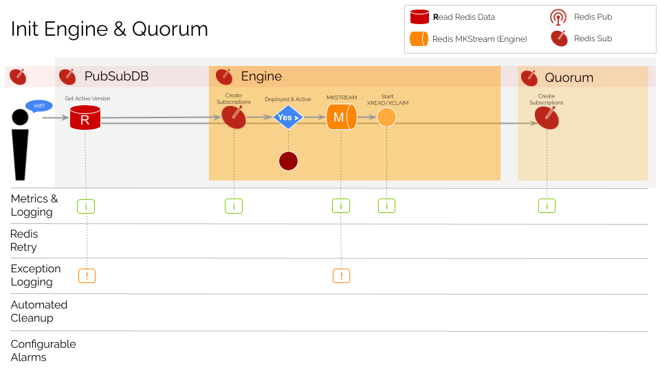

# System Lifecycle Guide

This README provides an overview of the `PubSubDB` runtime engine. The document is intended to serve as a resource for operations and infrastructure teams responsible for PubSubDB's monitoring, exception handling, cleanup procedures, and alarm configurations. 

## Table of Contents
1. [Init Engine & Quorum](#init-engine-and-quorum)
2. [Init Worker](#init-worker)
3. [Deploy Version](#deploy-version)
4. [Activate Version](#activate-version)
5. [Run Workflow](#run-workflow)

## Init Engine and Quorum
The engine is the core of the PubSubDB system and is responsible for running activities according to its execution rules. Every engine instance is initialized with a corresponding Quorum instance that serves to coordinate activities with other engines in the network. It is purposefully kept separate from the engine which is focused on workflow processes.

```javascript
import {
  PubSubDB,
  RedisStore,
  RedisStream,
  RedisSub } from '@pubsubdb/pubsubdb';

//init 3 Redis clients using `ioredis` or `redis` NPM packages
const storeClient = await getRedisClient(...)
const streamClient = await getRedisClient(...)
const subClient = await getRedisClient(...)

//init/start PubSubDB
const pubSubDB = await PubSubDB.init({
  appId: 'myapp',
  engine: {
    store: new RedisStore(storeClient),
    stream: new RedisStream(streamClient),
    sub: new RedisSub(subClient),
  }
});
```

The engine initialization process begins with a call to Redis (`HGET`) to get the active app version. The engine and the quorum then subscribe to relevant topics. The third Redis channel (streams) is only enabled if an *active app version* is returned from `HGET`.



## Init Worker
Workers are initialized similarly to the engine, using the same call to `init`. Each worker is initialized with a `topic`, `store`, `stream`, `sub`, and `callback` function. The `topic` is the name of the event that the callback function is subscribed to, serving as a link between the YAML rules and the execution runtime.

```javascript
import {
  PubSubDB,
  PubSubDBConfig,
  RedisStore
  RedisStream
  RedisSub } from '@pubsubdb/pubsubdb';

//init 3 standard Redis clients
const redisClient1 = getMyRedisClient();
const redisClient2 = getMyRedisClient();
const redisClient3 = getMyRedisClient();

const pubSubDB = await PubSubDB.init({
  appId: 'myapp',
  workers: [{

    //specify the worker topic
    topic: 'discounts.enumerate',

    store: new RedisStore(redisClient1),
    stream: new RedisStream(redisClient2),
    sub: new RedisSub(redisClient3),

    //register the worker function
    callback: async (data: StreamData) => { … }
  }]
});
```

The worker initialization process begins with a call to Redis (`HGET`) to get the active app version and subscribe to worker events. The third Redis channel (streams) is only enabled if an *active app version* is returned from `HGET`.


## Deploy Version
When the app YAML file is ready, the `deploy` function can be called. This function is responsible for merging all referenced YAML source files and writing the JSON output to the file system and to Redis. *The version will not be active until activation is explicitly called.*

```javascript
const deploymentStatus = await pubSubDB.deploy('./pubsubdb.yaml');
//returns true|false
```

The following infographic illustrates the app version *deployment* process.


## Activate Version
Once the app YAML file is deployed to Redis, the `activate` function can be called to enable it for the entire quorum at the same moment. The approach is to establish the coordinated health of the system through series of call/response exchanges. Once it is established that the quorum is healthy, the quorum is instructed to run their engine in 'no-cache' mode, ensuring that the Redis backend is consulted for the active app version each time a call is processes. This ensures that all engines are running the same version of the app, switching over at the same moment and then enabling 'cache' mode to improve performance.

```javascript
const activationStatus = await pubSubDB.activate('1');
//returns true|false
```

The following infographic illustrates the app version *activation* process.


## Run Workflow
Once the app is active, it's possible to send events and kick off workflows by publishing to known topics. For example, here is a fire-and-forget call to `pub`.

```javascript
const topic = 'discount.requested';
const payload = { id: 'ord123', price: 55.99 };
const jobId = await pubSubDB.pub(topic, payload);
//`jobId` will be `ord123`
```
And here is a call to `pubsub` which awaits the response like a typical fetch call but without the risk of backpressure due to the CQRS architecture.

```javascript
const topic = 'discount.requested';
const payload = { id: 'ord123', price: 55.99 };
const jobOutput: JobOutput = await pubSubDB.pubsub(topic, payload);
//`jobOutput.data.discount` is `5.00`
```
The following infographic illustrates the mechanics of the system and how the headless engine and workers are able to produce complex outcomes using   journaling and CQRS principles. Each time a *worker* or *engine* pulls an item from its assigned Redis Stream, it concludes by writing the outcome to another stream. This simple mechanism of reading from one stream and writing to another is the basis for the entire system and how complex workflows are achieved. Every complex workflow is simply a series of singular activities implicitly stitched together by writing to streams in a sequence.


